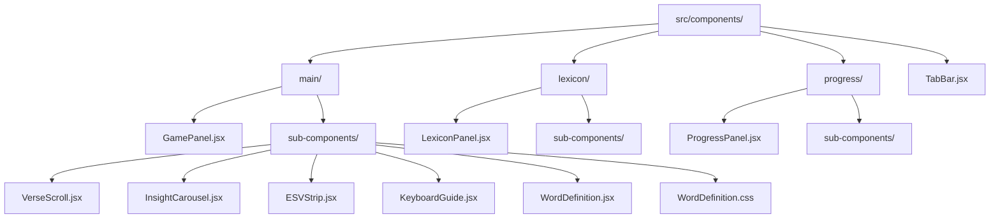

# Component Reorganization Plan

## Current Structure
```
src/components/
├── GamePanel.jsx
├── LexiconPanel.jsx
├── ProgressPanel.jsx
├── TabBar.jsx
├── VerseScroll.jsx
├── InsightCarousel.jsx
├── ESVStrip.jsx
├── KeyboardGuide.jsx
├── WordDefinition.jsx
└── WordDefinition.css
```

## Proposed Structure (Updated with sub-components)
```
src/components/
├── TabBar.jsx (stays at root)
├── main/
│   ├── GamePanel.jsx
│   └── sub-components/
│       ├── VerseScroll.jsx
│       ├── InsightCarousel.jsx
│       ├── ESVStrip.jsx
│       ├── KeyboardGuide.jsx
│       └── WordDefinition.jsx + .css
├── lexicon/
│   ├── LexiconPanel.jsx
│   └── sub-components/ (for future lexicon components)
└── progress/
    ├── ProgressPanel.jsx
    └── sub-components/ (for future progress components)
```

## Import Path Changes Required

### 1. Update `src/App.jsx`
Current imports:
```jsx
import GamePanel from './components/GamePanel'
import LexiconPanel from './components/LexiconPanel'
import ProgressPanel from './components/ProgressPanel'
import TabBar from './components/TabBar'
```

New imports:
```jsx
import GamePanel from './components/main/GamePanel'
import LexiconPanel from './components/lexicon/LexiconPanel'
import ProgressPanel from './components/progress/ProgressPanel'
import TabBar from './components/TabBar'  // unchanged
```

### 2. Update `src/components/main/GamePanel.jsx`
Current imports (lines 11-15):
```jsx
import VerseScroll from './VerseScroll'
import InsightCarousel from './InsightCarousel'
import ESVStrip from './ESVStrip'
import KeyboardGuide from './KeyboardGuide'
import WordDefinition from './WordDefinition'
```

New imports (using sub-components folder):
```jsx
import VerseScroll from './sub-components/VerseScroll'
import InsightCarousel from './sub-components/InsightCarousel'
import ESVStrip from './sub-components/ESVStrip'
import KeyboardGuide from './sub-components/KeyboardGuide'
import WordDefinition from './sub-components/WordDefinition'
```

### 3. Update asset imports in GamePanel.jsx
Current asset imports (lines 2-9):
```jsx
import versesFile from '../data/verses/genesis-1.json'
import wordsData from '../data/words.json'
import wordCompleteAudio from '../assets/audio/word_complete.mp3'
import newWordAudio from '../assets/audio/new_word.mp3'
import verseCompleteAudio from '../assets/audio/verse_complete.mp3'
import typingSound1 from '../assets/audio/typing_sound1.mp3'
import typingSound2 from '../assets/audio/typing_sound2.mp3'
import typingSound3 from '../assets/audio/typing_sound3.mp3'
import { LETTER_SBL, KEYS, KEYBOARD_ROWS, LATIN_TO_HEB } from '../utils/hebrewData'
```

These need to be updated for the new location (one level deeper):
```jsx
import versesFile from '../../data/verses/genesis-1.json'
import wordsData from '../../data/words.json'
import wordCompleteAudio from '../../assets/audio/word_complete.mp3'
import newWordAudio from '../../assets/audio/new_word.mp3'
import verseCompleteAudio from '../../assets/audio/verse_complete.mp3'
import typingSound1 from '../../assets/audio/typing_sound1.mp3'
import typingSound2 from '../../assets/audio/typing_sound2.mp3'
import typingSound3 from '../../assets/audio/typing_sound3.mp3'
import { LETTER_SBL, KEYS, KEYBOARD_ROWS, LATIN_TO_HEB } from '../../utils/hebrewData'
```

## Implementation Steps

### Phase 1: Create Folder Structure
1. Create directories:
   - `src/components/main/`
   - `src/components/main/sub-components/`
   - `src/components/lexicon/`
   - `src/components/lexicon/sub-components/`
   - `src/components/progress/`
   - `src/components/progress/sub-components/`

### Phase 2: Move Files
2. Move `GamePanel.jsx` to `src/components/main/GamePanel.jsx`
3. Move GamePanel sub-components to `src/components/main/sub-components/`:
   - `VerseScroll.jsx`
   - `InsightCarousel.jsx`
   - `ESVStrip.jsx`
   - `KeyboardGuide.jsx`
   - `WordDefinition.jsx`
   - `WordDefinition.css`
4. Move `LexiconPanel.jsx` to `src/components/lexicon/LexiconPanel.jsx`
5. Move `ProgressPanel.jsx` to `src/components/progress/ProgressPanel.jsx`
6. Keep `TabBar.jsx` in `src/components/`

### Phase 3: Update Import Paths
7. Update import paths in `src/App.jsx`
8. Update import paths in `src/components/main/GamePanel.jsx`
9. Update asset import paths in `src/components/main/GamePanel.jsx`

### Phase 4: Testing
10. Run `npm run dev` to verify no import errors
11. Test tab switching functionality
12. Test GamePanel typing functionality
13. Verify all audio assets load correctly

## Risk Mitigation

### Potential Issues:
1. **Relative path errors**: Moving files changes relative paths to assets and utilities
2. **CSS import issues**: `WordDefinition.css` needs to stay with `WordDefinition.jsx`
3. **Hot module replacement**: Vite may need to restart after file moves
4. **Git tracking**: Files will appear as deleted/added (not renamed)

### Safety Measures:
1. Keep a backup of the original `src/components/` folder
2. Make changes incrementally and test after each major change
3. Use the running dev server to catch errors immediately
4. Have a rollback plan (git checkout or restore from backup)

## Benefits of This Structure

1. **Better organization**: Components grouped by feature/domain with clear `sub-components` naming
2. **Scalability**: Easy to add new components to each feature area
3. **Maintainability**: Clear separation of concerns
4. **Team collaboration**: Different developers can work on different features without conflicts
5. **Future-proof**: Ready for expansion of lexicon and progress features with dedicated `sub-components` folders

## Mermaid Diagram of Final Structure



## Next Steps
1. Review and approve this updated plan
2. Switch to Code mode for implementation
3. Execute the implementation steps in order
4. Test thoroughly after implementation
5. Commit changes to version control