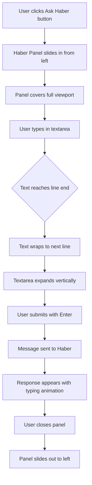

# Haber Panel Improvements Plan

## Current State Analysis

### 1. Button in WordDefinition Component
- **Location**: [`WordDefinition.jsx:129`](src/components/main/sub-components/WordDefinition.jsx:129)
- **Current text**: "Haber"
- **Current styling**: Purple border, transparent background, white text on hover
- **CSS class**: `.haber-open-btn` in [`WordDefinition.css:18`](src/components/main/sub-components/WordDefinition.css:18)

### 2. Haber Panel Component
- **Component**: [`HaberPanel.jsx`](src/components/main/sub-components/HaberPanel.jsx)
- **Current layout**: `.haber-sidebar` with `width: 45%`, positioned absolutely
- **Animation**: Subtle slide-in from left (`translateX(-10px)`)
- **Current input**: Single-line `<input type="text">`

### 3. Parent Container (GamePanel)
- **Rendering**: Conditional rendering when `haberOpen` is true
- **Position**: Overlays on top of content in `.haber-sidebar` container

## Requested Changes

1. **Button text**: Change from "Haber" to "Ask Haber"
2. **Button styling**: Add fill color (purple with white font)
3. **Panel animation**: Slide from left of screen (more dramatic)
4. **Panel size**: Full viewport width and height
5. **Typing box**: Text wrapping with vertical expansion

## Implementation Plan

### Phase 1: Button Updates
1. Update button text in `WordDefinition.jsx`
2. Modify `.haber-open-btn` CSS for solid purple background
3. Ensure white text color and proper hover states

### Phase 2: Panel Layout & Animation
1. Update `.haber-sidebar` CSS:
   - Change `width: 45%` to `width: 100%`
   - Change `position: absolute` to `position: fixed` for full viewport
   - Update animation to slide from left edge (`translateX(-100%)` to `translateX(0)`)
   - Add `z-index` to ensure it overlays everything

2. Update animation keyframes in `HaberPanel.css`:
   - More dramatic slide from left
   - Ensure smooth transition

### Phase 3: Typing Box Improvements
1. Replace `<input type="text">` with `<textarea>` in `HaberPanel.jsx`
2. Implement auto-expanding textarea:
   - Use `useRef` to track textarea element
   - Adjust height based on `scrollHeight`
   - Add max-height limit with scroll
3. Update CSS for textarea styling
4. Handle Enter key for submission (Shift+Enter for new line)

## Technical Implementation Details

### Button Changes
```css
/* Updated .haber-open-btn */
.haber-open-btn {
  background: var(--purple); /* Solid fill */
  color: #fff; /* White text */
  border: 1px solid var(--purple);
  /* ... existing properties ... */
}

.haber-open-btn:hover {
  background: var(--purple-mid); /* Slightly darker on hover */
  color: #fff;
}
```

### Panel Layout Changes
```css
/* Updated .haber-sidebar */
.haber-sidebar {
  position: fixed;
  left: 0;
  top: 0;
  bottom: 0;
  width: 100%;
  z-index: 1000;
  background: var(--bg-card);
  border-right: 1px solid var(--border);
  animation: haberSlideIn 0.3s ease-out;
}

@keyframes haberSlideIn {
  from { 
    opacity: 0;
    transform: translateX(-100%);
  }
  to { 
    opacity: 1;
    transform: translateX(0);
  }
}
```

### Textarea Implementation
```jsx
// In HaberPanel.jsx
const textareaRef = useRef(null);

const handleTextareaChange = (e) => {
  setInputText(e.target.value);
  // Auto-expand textarea
  const textarea = textareaRef.current;
  if (textarea) {
    textarea.style.height = 'auto';
    textarea.style.height = `${textarea.scrollHeight}px`;
  }
};

// Replace input with textarea
<textarea
  ref={textareaRef}
  className="haber-textarea"
  placeholder="Wrestle with it..."
  value={inputText}
  onChange={handleTextareaChange}
  onKeyDown={handleKeyDown}
  disabled={haberLoading}
  rows={1}
/>
```

## Mermaid Diagram: New Haber Panel Flow



## Files to Modify

1. **`src/components/main/sub-components/WordDefinition.jsx`**
   - Line 129: Change button text to "Ask Haber"

2. **`src/components/main/sub-components/WordDefinition.css`**
   - Lines 18-38: Update `.haber-open-btn` styling

3. **`src/components/main/sub-components/HaberPanel.css`**
   - Lines 13-33: Update `.haber-sidebar` styling and animation
   - Lines 259-310: Update input styling for textarea

4. **`src/components/main/sub-components/HaberPanel.jsx`**
   - Lines 306-324: Replace input with textarea
   - Add textarea auto-expand logic

## Testing Checklist

- [ ] Button displays "Ask Haber" with purple fill
- [ ] Panel slides in from left edge of screen
- [ ] Panel covers full viewport width and height
- [ ] Textarea expands vertically with text wrapping
- [ ] Enter key submits message (Shift+Enter adds new line)
- [ ] Panel closes properly and slides out
- [ ] All existing functionality preserved

## Potential Issues & Solutions

1. **Z-index conflicts**: Ensure `.haber-sidebar` has high enough z-index
2. **Mobile responsiveness**: Test on different screen sizes
3. **Textarea max height**: Set reasonable max-height with scroll
4. **Animation performance**: Use CSS transforms for smooth animation
5. **Focus management**: Ensure textarea gets focus when panel opens

## Success Criteria

1. Button is more eye-catching with purple fill
2. Panel slides dramatically from left edge
3. Chat screen is significantly larger (full viewport)
4. Typing experience improves with text wrapping
5. User can type longer messages without horizontal scrolling