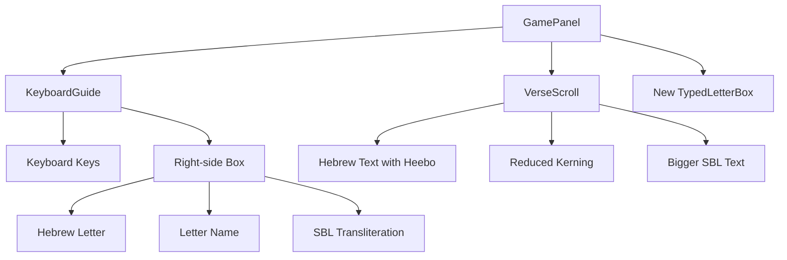

# Hebrew Bible Game - Font and Keyboard Improvements Plan

## Overview
This plan outlines the changes needed to improve the Hebrew typography and keyboard interface based on user requirements.

## Current Analysis
The project is a Hebrew Bible typing game with the following key components:
- `VerseScroll.jsx`: Displays Hebrew verses with SBL transliterations
- `KeyboardGuide.jsx`: Shows Hebrew keyboard layout with letter sounds
- `src/index.css`: Contains all styling including Hebrew font settings
- `src/data/letters.json`: Contains Hebrew letter data including SBL transliterations

## Requirements Summary
1. Change Hebrew font to Heebo for all Hebrew text
2. Reduce kerning on VerseScroll Hebrew text (keep some spacing)
3. Update SBL letter formatting in `letters.json` (change "b / v" to "b/v")
4. Make SBL letter font bigger and more visible
5. Remove italic from SBL letter styling
6. Make active verse text bigger
7. Remove SBL letter sound from keyboard
8. Increase Hebrew letter size on keyboard for better visibility
9. Add new box on right of keyboard showing typed letter with name and SBL below

## Detailed Implementation Plan

### 1. Update Hebrew Font to Heebo
**Files to modify:**
- `src/index.css`: Update font imports and CSS rules
- All components using Hebrew text

**Changes:**
- Add Heebo font import from Google Fonts
- Update CSS variables to include Heebo
- Change `.word-char` font-family from 'Times New Roman' to 'Heebo'
- Update `.verse-plain` font-family to 'Heebo'
- Update `.kb-heb` font-family to 'Heebo'

### 2. Reduce Kerning on VerseScroll
**Files to modify:**
- `src/index.css`: Adjust letter-spacing properties

**Changes:**
- Reduce or remove `letter-spacing` on `.word-char` and `.word-letter-cols`
- Adjust spacing between Hebrew letters to be more natural

### 3. Update SBL Letter Formatting
**Files to modify:**
- `src/data/letters.json`: Update SBL values

**Changes:**
- Change "b / v" to "b/v" (and similar patterns)
- Update corresponding values in `hebrewData.js` if referenced

### 4. Make SBL Letter Font Bigger and More Visible
**Files to modify:**
- `src/index.css`: Update SBL styling

**Changes:**
- Increase font-size of `.word-sbl-ch` from 9px to 11px
- Change color from muted to more visible (e.g., `var(--text-secondary)`)
- Increase font-weight if needed

### 5. Remove Italic from SBL Letter Styling
**Files to modify:**
- `src/index.css`: Remove italic style

**Changes:**
- Remove `font-style: italic` from `.word-sbl-ch`
- Use normal font style for better readability

### 6. Make Active Verse Text Bigger
**Files to modify:**
- `src/index.css`: Increase font sizes

**Changes:**
- Increase `.word-char` font-size from 30px to 34px or larger
- Adjust container sizes accordingly

### 7. Remove SBL Letter Sound from Keyboard
**Files to modify:**
- `src/components/KeyboardGuide.jsx`: Remove sound display
- `src/index.css`: Remove sound styling

**Changes:**
- Remove `.kb-sound` element from KeyboardGuide component
- Remove corresponding CSS rules for `.kb-sound`
- Update keyboard layout to focus only on Hebrew letters

### 8. Increase Hebrew Letter Size on Keyboard
**Files to modify:**
- `src/index.css`: Increase keyboard font sizes

**Changes:**
- Increase `.kb-heb` font-size from 18px to 22px or larger
- Adjust keyboard key sizes if needed

### 9. Add New Box Component for Typed Letter Display
**Files to modify:**
- `src/components/KeyboardGuide.jsx`: Add new display box
- `src/components/GamePanel.jsx`: Pass typed letter data
- `src/index.css`: Style the new box

**Changes:**
- Create new component or modify KeyboardGuide to include right-side box
- Display most recently typed Hebrew letter
- Show letter name (e.g., "Bet") below the letter
- Show SBL transliteration (e.g., "b/v") below the name
- Style with appropriate sizing and colors

## Component Architecture

## Files to Create/Modify

### CSS Changes (`src/index.css`):
1. Add Heebo font import
2. Update CSS variables
3. Modify Hebrew text styling
4. Update keyboard styling
5. Add new styles for typed letter box

### Component Changes:
1. `KeyboardGuide.jsx`: Remove sound, add typed letter box
2. `GamePanel.jsx`: Track and pass most recent typed letter
3. `VerseScroll.jsx`: Ensure Hebrew text uses Heebo font

### Data Changes:
1. `letters.json`: Update SBL formatting

## Testing Checklist
- [ ] Hebrew text displays with Heebo font throughout app
- [ ] VerseScroll Hebrew spacing looks natural
- [ ] SBL text is larger, non-italic, and more visible
- [ ] Active verse text is noticeably larger
- [ ] Keyboard shows only Hebrew letters (no sounds)
- [ ] Keyboard Hebrew letters are larger and more visible
- [ ] Right-side box shows typed letter with name and SBL
- [ ] All changes work in both light and dark modes
- [ ] Game functionality remains intact

## Dependencies
- Heebo font from Google Fonts (needs internet connection)
- No additional npm packages required

## Notes
- Heebo is a modern Hebrew font designed for screen readability
- Removing kerning will make Hebrew text flow more naturally
- Larger keyboard letters improve accessibility
- The typed letter box provides immediate feedback to users