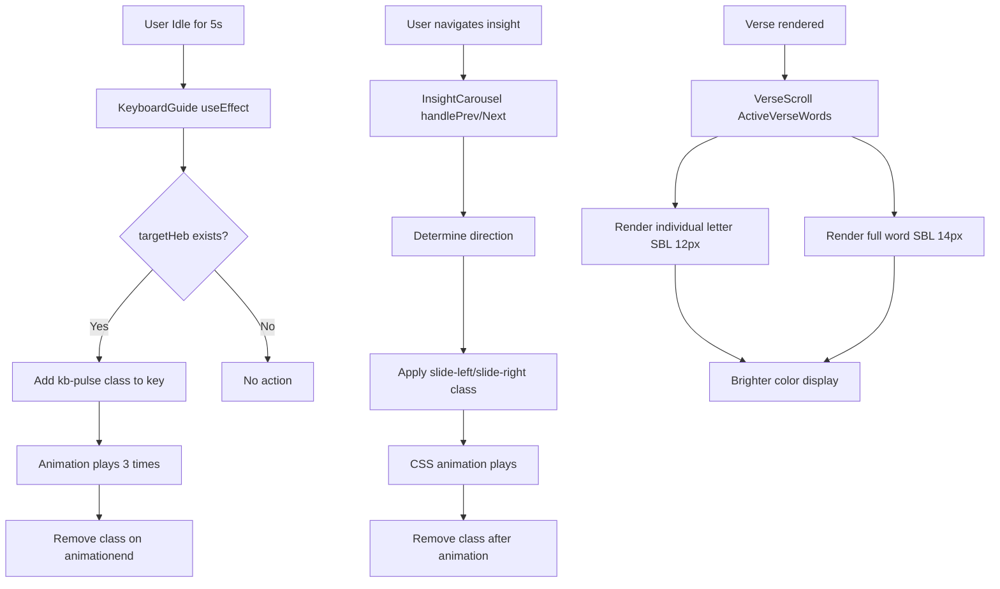

# Insight Panel, SBL Letters, and Keyboard Improvements Plan

## Overview
This document outlines the planned improvements for three areas of the Hebrew Bible Game:
1. Insight Panel carousel sliding animation
2. SBL letter styling (individual and full word)
3. Keyboard idle pulse guidance

## Current State Analysis

### 1. Insight Panel Carousel (`src/components/InsightCarousel.jsx`)
- **Current behavior**: Whole panel has `slideUpBounce` animation on entrance (when `celebrate` class is applied)
- **Issue**: When user navigates between insights (via buttons or auto-slide), there's no visual transition
- **Requirement**: Only the text content should slide left/right during navigation, not the entire panel

### 2. SBL Letter Styling (`src/index.css`)
- **Individual letter SBL** (`.word-sbl-ch`): 11px, color: `var(--text-secondary)` (muted)
- **Full word SBL** (`.word-full-sbl`): 11px, color: `var(--text-secondary)` (muted)
- **Requirement**: 
  - Individual letter SBL: Increase to 12px, make color brighter
  - Full word SBL: Increase to 14px, make color brighter

### 3. Keyboard Pulse Guidance (`src/components/KeyboardGuide.jsx`)
- **Current implementation**: Pulse animation after 10 seconds of idle time
- **Issue**: Pulse may not be activating correctly
- **Requirement**: Fix pulse activation and reduce timing to 5 seconds

## Implementation Plan

### 1. Insight Panel Carousel Sliding Animation

**Changes to `src/index.css`:**
```css
/* Add new keyframes for left/right sliding */
@keyframes slideLeft {
  0% { transform: translateX(20px); opacity: 0; }
  100% { transform: translateX(0); opacity: 1; }
}

@keyframes slideRight {
  0% { transform: translateX(-20px); opacity: 0; }
  100% { transform: translateX(0); opacity: 1; }
}

/* Add animation classes for the text content */
.ic-text.slide-left {
  animation: slideLeft 0.4s ease-out;
}

.ic-text.slide-right {
  animation: slideRight 0.4s ease-out;
}
```

**Changes to `src/components/InsightCarousel.jsx`:**
- Add state to track slide direction
- Apply appropriate CSS class to `.ic-text` based on navigation direction
- Remove `celebrate` animation from panel during navigation (keep only for initial entrance)

### 2. SBL Letter Styling Updates

**Changes to `src/index.css`:**
```css
/* Individual letter SBL - increase from 11px to 12px, brighter color */
.word-sbl-ch {
  font-size: 12px; /* Increased from 11px */
  font-family: var(--font-serif);
  font-style: normal;
  font-weight: 500;
  color: var(--text-primary); /* Brighter color instead of transparent/var(--text-secondary) */
  line-height: 1;
  min-height: 14px; /* Adjusted for larger font */
  white-space: nowrap;
  transition: color 0.2s;
  opacity: 0.9; /* Slightly transparent for subtlety */
}

/* Full word SBL - increase from 11px to 14px, brighter color */
.word-full-sbl {
  font-family: var(--font-serif);
  font-size: 14px; /* Increased from 11px */
  color: var(--text-primary); /* Brighter color */
  margin-top: 4px; /* Slightly more spacing */
  letter-spacing: 0.3px;
  white-space: nowrap;
  font-weight: 600; /* Bolder for emphasis */
  opacity: 0.95;
}
```

### 3. Keyboard Pulse Timing Fix

**Changes to `src/components/KeyboardGuide.jsx`:**
- Update `setTimeout` from 10000ms to 5000ms (line 51)
- Ensure pulse animation triggers correctly by verifying:
  - `targetHeb` is properly passed
  - `keyRefs.current` contains the correct element reference
  - Animation classes are applied and removed correctly

**Potential debugging steps:**
1. Add console logging to verify `targetHeb` value
2. Check if `keyRefs.current[targetHeb]` exists
3. Verify CSS animation `kb-pulse` is defined and working

## Mermaid Diagram: Component Interaction Flow



## Files to Modify

1. `src/index.css` - Add new animations and update SBL styling
2. `src/components/InsightCarousel.jsx` - Implement text sliding logic
3. `src/components/KeyboardGuide.jsx` - Fix pulse timing and activation

## Testing Checklist

- [ ] Insight Panel: Verify entrance animation still works (slide-up)
- [ ] Insight Panel: Verify text slides left/right on navigation
- [ ] SBL Letters: Check individual letter SBL is 12px and brighter
- [ ] SBL Letters: Check full word SBL is 14px and brighter  
- [ ] Keyboard: Verify pulse activates after 5 seconds of idle time
- [ ] Keyboard: Verify pulse animation is subtle but noticeable
- [ ] Keyboard: Verify pulse stops after user interaction

## Success Criteria

1. Insight Panel carousel text smoothly slides left/right during navigation
2. SBL letters are more readable with increased size and brighter colors
3. Keyboard provides subtle guidance pulse after 5 seconds of inactivity
4. All existing functionality remains intact