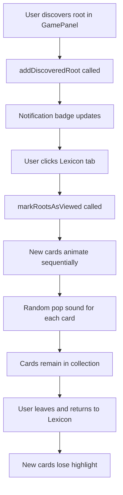

# Lexicon Panel Card Collection Implementation Plan

## Overview
Implement a full Lexicon panel that displays collected Hebrew root cards in a gacha/collectible style. When users discover new roots, cards pop up with animations and sound effects, then remain in the collection permanently.

## Current State Analysis

### Existing Components
1. **`RootDiscoveryContext.jsx`** - Already provides:
   - `newRoots` array (roots discovered but not yet viewed)
   - `discoveredRoots` array (all roots discovered)
   - `markRootsAsViewed()` function (clears newRoots when Lexicon opened)
   - `addDiscoveredRoot()` function (called by GamePanel when root discovered)

2. **`TabBar.jsx`** - Already has notification badge implementation
3. **`App.jsx`** - Already calls `markRootsAsViewed()` when Lexicon tab opened
4. **`LexiconPanel.jsx`** - Currently a placeholder panel
5. **Audio Assets** - 4 pop sounds available in `src/assets/audio/pop-1.mp3` through `pop-4.mp3`

## Requirements Summary

1. **Card Display**: Show ALL discovered roots as collectible cards
2. **New Card Animation**: When Lexicon opened with new roots, cards pop up one after another (fast, can overlap)
3. **Card Content**: Each card displays:
   - Hebrew Letter (root)
   - SBL Word (transliteration)
   - Gloss (English meaning)
4. **Highlighting**: New cards are highlighted (different border/background)
5. **Sound Effects**: Play random pop sound for each card animation
6. **Persistence**: Cards remain in collection after animation
7. **Highlight Reset**: When user leaves and returns to Lexicon, new cards lose highlight

## Technical Design

### 1. Lexicon Panel Structure
```jsx
// src/components/lexicon/LexiconPanel.jsx
import React, { useEffect, useState } from 'react';
import { useRootDiscovery } from '../../contexts/RootDiscoveryContext';
import RootCard from './sub-components/RootCard';
import './LexiconPanel.css';

const LexiconPanel = () => {
  const { discoveredRoots, newRoots, markRootsAsViewed } = useRootDiscovery();
  const [animatingCards, setAnimatingCards] = useState([]);
  const [animationComplete, setAnimationComplete] = useState(false);
  
  // Trigger animations when panel mounts with new roots
  useEffect(() => {
    if (newRoots.length > 0) {
      // Start sequential animation
      animateNewCards(newRoots);
      // Mark as viewed after animation completes
      setTimeout(() => {
        markRootsAsViewed();
      }, newRoots.length * 300 + 500); // Adjust timing based on animation duration
    }
  }, []);
  
  const animateNewCards = (roots) => {
    // Implementation for sequential card pop-up
  };
  
  return (
    <div className="lexicon-panel">
      <div className="lexicon-header">
        <h1>Hebrew Roots Lexicon</h1>
        <p className="lexicon-subtitle">
          Collected {discoveredRoots.length} of {totalRoots} roots
        </p>
      </div>
      
      <div className="lexicon-grid">
        {discoveredRoots.map((root) => (
          <RootCard 
            key={root.id}
            root={root}
            isNew={newRoots.some(r => r.id === root.id) && !animationComplete}
            animationOrder={/* determine order for new cards */}
          />
        ))}
      </div>
    </div>
  );
};
```

### 2. Root Card Component
```jsx
// src/components/lexicon/sub-components/RootCard.jsx
import React, { useEffect, useRef, useState } from 'react';
import './RootCard.css';

const RootCard = ({ root, isNew, animationOrder }) => {
  const [isAnimating, setIsAnimating] = useState(false);
  const cardRef = useRef(null);
  
  useEffect(() => {
    if (isNew && animationOrder >= 0) {
      // Trigger animation with delay based on order
      const timer = setTimeout(() => {
        setIsAnimating(true);
        playRandomPopSound();
      }, animationOrder * 150); // 150ms between cards
      
      return () => clearTimeout(timer);
    }
  }, [isNew, animationOrder]);
  
  const playRandomPopSound = () => {
    // Play one of the 4 pop sounds
  };
  
  return (
    <div 
      ref={cardRef}
      className={`root-card ${isNew ? 'root-card-new' : ''} ${isAnimating ? 'root-card-pop' : ''}`}
      style={{
        animationDelay: isNew ? `${animationOrder * 150}ms` : '0ms'
      }}
    >
      <div className="root-card-header">
        <div className="root-hebrew">{root.id}</div>
        <div className="root-new-badge">{isNew && 'NEW'}</div>
      </div>
      
      <div className="root-card-content">
        <div className="root-sbl">{root.sbl}</div>
        <div className="root-gloss">{root.gloss}</div>
      </div>
      
      <div className="root-card-footer">
        <div className="root-strongs">{root.strongs}</div>
      </div>
    </div>
  );
};
```

### 3. CSS Styling

#### Lexicon Panel CSS
```css
/* src/components/lexicon/LexiconPanel.css */
.lexicon-panel {
  height: 100%;
  background: var(--bg);
  padding: 24px;
  overflow-y: auto;
}

.lexicon-header {
  margin-bottom: 32px;
  text-align: center;
}

.lexicon-header h1 {
  font-family: var(--font-serif);
  font-size: 28px;
  color: var(--text-primary);
  margin-bottom: 8px;
}

.lexicon-subtitle {
  font-size: 16px;
  color: var(--text-secondary);
}

.lexicon-grid {
  display: grid;
  grid-template-columns: repeat(auto-fill, minmax(280px, 1fr));
  gap: 20px;
  max-width: 1200px;
  margin: 0 auto;
}
```

#### Root Card CSS
```css
/* src/components/lexicon/sub-components/RootCard.css */
.root-card {
  background: var(--bg-card);
  border-radius: var(--radius-lg);
  padding: 20px;
  box-shadow: var(--shadow-card);
  border: 2px solid transparent;
  transition: all 0.3s ease;
  position: relative;
  overflow: hidden;
}

.root-card-new {
  border-color: var(--coral);
  box-shadow: 0 0 0 3px rgba(255, 95, 64, 0.1);
}

.root-card-pop {
  animation: cardPop 0.5s cubic-bezier(0.175, 0.885, 0.32, 1.275) forwards;
}

@keyframes cardPop {
  0% {
    transform: scale(0.8) translateY(20px);
    opacity: 0;
  }
  70% {
    transform: scale(1.05) translateY(-5px);
  }
  100% {
    transform: scale(1) translateY(0);
    opacity: 1;
  }
}

.root-card-header {
  display: flex;
  justify-content: space-between;
  align-items: flex-start;
  margin-bottom: 16px;
}

.root-hebrew {
  font-family: var(--font-hebrew);
  font-size: 32px;
  font-weight: 600;
  color: var(--text-primary);
}

.root-new-badge {
  background: var(--coral);
  color: white;
  font-size: 11px;
  font-weight: 600;
  padding: 4px 8px;
  border-radius: var(--radius-pill);
  text-transform: uppercase;
  letter-spacing: 0.5px;
}

.root-card-content {
  margin-bottom: 16px;
}

.root-sbl {
  font-family: var(--font-serif);
  font-size: 18px;
  color: var(--purple);
  margin-bottom: 8px;
  font-style: italic;
}

.root-gloss {
  font-size: 16px;
  color: var(--text-primary);
  line-height: 1.4;
}

.root-card-footer {
  border-top: 1px solid var(--border);
  padding-top: 12px;
  font-size: 14px;
  color: var(--text-muted);
}
```

### 4. Audio Utility
```jsx
// src/utils/audioUtils.js
export const playRandomPopSound = () => {
  const popSounds = [
    new Audio('/src/assets/audio/pop-1.mp3'),
    new Audio('/src/assets/audio/pop-2.mp3'),
    new Audio('/src/assets/audio/pop-3.mp3'),
    new Audio('/src/assets/audio/pop-4.mp3'),
  ];
  
  const randomIndex = Math.floor(Math.random() * popSounds.length);
  const sound = popSounds[randomIndex];
  sound.volume = 0.3;
  sound.play().catch(e => console.log('Audio play failed:', e));
};
```

## Implementation Steps

1. **Create RootCard component** with proper styling and animation hooks
2. **Update LexiconPanel** to display grid of cards
3. **Implement animation logic** for sequential card pop-up
4. **Add audio integration** with random pop sounds
5. **Implement highlighting system** for new cards
6. **Test integration** with RootDiscoveryContext
7. **Add responsive design** for different screen sizes
8. **Test complete user flow** from root discovery to Lexicon display

## User Flow Diagram


## Success Criteria
1. Cards display Hebrew root, SBL transliteration, and gloss
2. New cards animate sequentially with pop sounds
3. Animation is fast with possible overlap
4. New cards are highlighted with distinct styling
5. Highlight disappears when user leaves and returns
6. All discovered roots persist in the collection
7. Notification badge works correctly
8. Responsive grid layout adapts to screen size