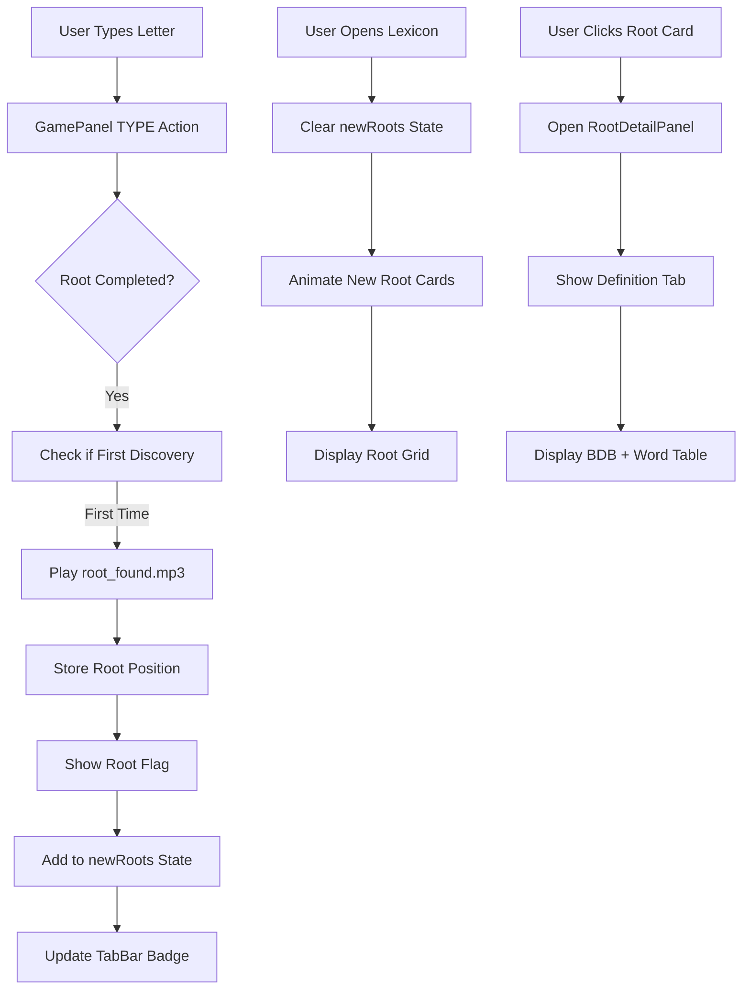

# Lexicon and Root Discovery Feature Implementation Plan

## Overview
This plan outlines the implementation of the Lexicon and Root Discovery feature for the Hebrew Bible Game. The feature includes real-time root detection during typing, visual notifications, a redesigned Lexicon panel with root cards, and detailed root definition views.

## Current State Analysis

### Existing Components
- **GamePanel** (`src/components/main/GamePanel.jsx`): Main typing interface with reducer state management
- **VerseScroll** (`src/components/main/sub-components/VerseScroll.jsx`): Displays Hebrew words with typing progress
- **LexiconPanel** (`src/components/lexicon/LexiconPanel.jsx`): Currently a placeholder panel
- **TabBar** (`src/components/TabBar.jsx`): Navigation between Main, Lexicon, and Progress tabs
- **App** (`src/App.jsx`): Manages active tab state

### Data Structures
- **roots.json** (`src/data/roots.json`): 31 Hebrew roots with SBL, gloss, BDB meaning, Strong's number
- **words.json** (`src/data/words.json`): Hebrew words with root associations, segments, explanations
- **audio files**: `root_found.mp3` already exists in `src/assets/audio/`

## Feature Requirements

### 1. Root Detection During Typing
- Detect when user types the last letter of a root within a word
- Example: In "בראשית" (bereshit), detect when last letter of root "ראש" is typed
- Only trigger on first discovery of each root

### 2. Root Discovery Notification
- Play `root_found.mp3` audio
- Show flag with "Root found" text sliding up over the Hebrew letters of the root
- Flag stays for 2 seconds, then slides out
- Position flag directly over the root letters within the word in the verse display

### 3. Lexicon Tab Notification
- Red dot badge with count of newly discovered roots
- Badge appears on Lexicon tab button
- Clears when user opens Lexicon panel

### 4. Lexicon Panel Redesign
- Display root cards in grid layout
- Each card shows: Hebrew root, SBL transliteration, Gloss
- Newly discovered roots animate into position (fast sequential animation)
- Latest discovered roots appear top-left initially
- Cards are clickable to open root detail view

### 5. Root Detail Panel
- Opens when clicking a root card
- Two tabs: "Definition" and "Concordance Map"

#### Definition Tab Content:
- Hebrew root
- SBL transliteration  
- Gloss
- BDB meaning (from roots.json)
- Strong's number as side note
- Table of discovered words using this root:
  - Columns: Hebrew Word > SBL Word > Gloss
  - Only includes words that have been discovered
  - Includes the root itself as a word if discovered

#### Concordance Map Tab:
- Placeholder: "Coming soon" message
- Reserved for future development

### 6. State Management
- Track discovered roots (first-time detection)
- Track newly discovered roots (not yet viewed in Lexicon)
- Track root discovery positions (for flag placement)
- Track discovered words per root (for definition tab word list)
- State persists only for current session (no localStorage yet)

## Technical Design

### State Additions to GamePanel Reducer

```javascript
// Add to initialState in GamePanel.jsx
const initialState = {
  // ... existing state
  discoveredRoots: {},           // { [rootId]: true }
  newRoots: {},                  // { [rootId]: true } - roots not yet viewed in Lexicon
  rootDiscoveryPositions: {},    // { [rootId]: { verseIndex, wordIndex, rootStartIdx, rootEndIdx } }
  discoveredWordsByRoot: {},     // { [rootId]: Set(wordId1, wordId2, ...) }
};

// New action types
'ROOT_DISCOVERED'   // When a root is first detected
'VIEWED_IN_LEXICON' // When user opens Lexicon panel
```

### Root Detection Algorithm

1. **During TYPE action in reducer**:
   - Get current word being typed
   - Check words.json for word's root and segment information
   - Monitor typed letters to detect when root completion occurs
   - When last letter of root is typed AND root not in discoveredRoots:
     - Dispatch ROOT_DISCOVERED action
     - Store position data for flag placement
     - Add word to discoveredWordsByRoot

2. **Position Calculation**:
   - Need to find root letters within the word
   - Use segment data from words.json to identify root letter positions
   - Calculate pixel position within VerseScroll for flag placement

### Component Architecture

#### New Components:
1. **RootFlag** (`src/components/main/sub-components/RootFlag.jsx`)
   - Absolute positioned overlay for "Root found" flag
   - Slide up/down animation with 2-second timer
   - Receives position props from GamePanel

2. **LexiconPanel** (Redesigned) (`src/components/lexicon/LexiconPanel.jsx`)
   - Grid of RootCard components
   - Manages new root animations
   - Connects to GamePanel state for discovered roots

3. **RootCard** (`src/components/lexicon/sub-components/RootCard.jsx`)
   - Displays Hebrew root, SBL, Gloss
   - Click handler to open RootDetailPanel
   - Entrance animation when newly discovered

4. **RootDetailPanel** (`src/components/lexicon/sub-components/RootDetailPanel.jsx`)
   - Modal/overlay panel with two tabs
   - Definition tab with BDB meaning and word table
   - Concordance Map placeholder tab

5. **NotificationBadge** (`src/components/TabBar/NotificationBadge.jsx`)
   - Red dot with count for Lexicon tab
   - Integrated into TabBar component

#### Modified Components:
1. **GamePanel** (`src/components/main/GamePanel.jsx`)
   - Add root detection logic to TYPE reducer case
   - Manage RootFlag component rendering
   - Pass state to LexiconPanel via context or props

2. **TabBar** (`src/components/TabBar.jsx`)
   - Add NotificationBadge to Lexicon tab button
   - Receive newRoots count from GamePanel state

3. **VerseScroll** (`src/components/main/sub-components/VerseScroll.jsx`)
   - Provide refs for word letter positions
   - Allow RootFlag to be positioned relative to word letters

## Implementation Roadmap

### Phase 1: Foundation & State Management
1. **Extend GamePanel state** with root discovery fields
2. **Create root detection utility** to identify root completion within words
3. **Implement ROOT_DISCOVERED reducer logic** in GamePanel
4. **Add audio playback** for root_found.mp3

### Phase 2: Visual Notifications
5. **Create RootFlag component** with slide animations
6. **Integrate flag positioning** with VerseScroll word coordinates
7. **Add flag display logic** to GamePanel (show/hide with timer)

### Phase 3: Lexicon Panel Redesign
8. **Redesign LexiconPanel** with root card grid layout
9. **Create RootCard component** with basic styling
10. **Implement new root animation** (entrance effects)
11. **Add click handlers** for root detail view

### Phase 4: Root Detail View
12. **Create RootDetailPanel component** with tab navigation
13. **Build Definition tab** with root data from roots.json
14. **Implement word table** filtering discovered words by root
15. **Add Concordance Map placeholder** tab

### Phase 5: Tab Integration & Polish
16. **Add NotificationBadge** to TabBar for Lexicon tab
17. **Implement newRoots tracking** (clear when Lexicon opened)
18. **Test complete user flow**: typing → flag → notification → Lexicon → detail view
19. **Polish animations and timing**

## Data Flow Diagram



## CSS & Styling Requirements

### New CSS Classes Needed:
- `.root-flag`: Flag notification styling
- `.root-flag-slide-up`, `.root-flag-slide-down`: Animation classes
- `.lexicon-grid`: Grid layout for root cards
- `.root-card`: Individual root card styling
- `.root-card-new`: Special styling for newly discovered roots
- `.root-detail-panel`: Modal/overlay panel
- `.tab-badge`: Red notification badge
- `.definition-table`: Table for words using root

### Animation Keyframes:
- Slide up/down for flag
- Fade in/scale for new root cards
- Tab transition for root detail panel

## Testing Considerations

### Test Scenarios:
1. **Root Detection**: Type "בראשית" → flag appears over "ראש"
2. **Multiple Roots**: Discover multiple roots in sequence
3. **Notification Badge**: Count increments with new discoveries
4. **Lexicon Clear**: Badge clears when Lexicon opened
5. **Root Detail**: Click root card → shows correct definition and word list
6. **Session Persistence**: State maintained during session but not across refresh

### Edge Cases:
- Words with multiple roots (if any)
- Roots that appear as standalone words
- Rapid typing triggering multiple root discoveries
- Opening Lexicon while flag is still visible

## Dependencies & Integration Points

### Data Dependencies:
- `roots.json` structure must remain stable
- `words.json` must have accurate root and segment data
- Audio file `root_found.mp3` must exist

### Component Dependencies:
- GamePanel must pass state to App/TabBar for badge
- VerseScroll must provide DOM refs for positioning
- All components must work with existing dark/light theme

## Future Enhancements (Post-MVP)

1. **LocalStorage Persistence**: Save discovered roots across sessions
2. **Root Sorting Options**: Alphabetical, frequency, discovery order
3. **Concordance Map**: Visual representation of root usage across verses
4. **Root Statistics**: Track mastery, review frequency
5. **Export/Import**: Share root discoveries
6. **Root Families**: Group related roots together
7. **Audio Variations**: Different sounds for different root types

## Success Metrics
- Users can discover and view all 31 roots in Genesis 1
- Flag notifications are timely and non-intrusive
- Lexicon provides meaningful vocabulary building
- Root detail view enhances learning experience
- Feature works seamlessly with existing typing gameplay