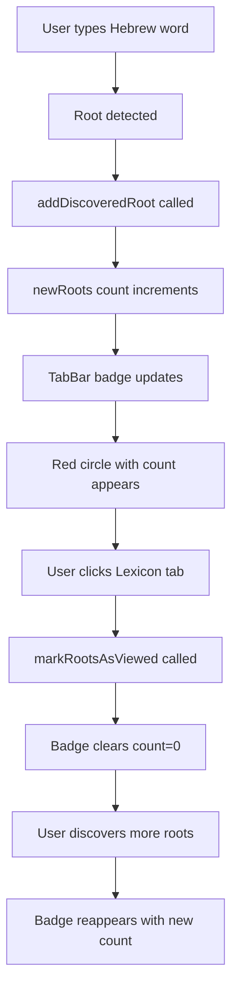
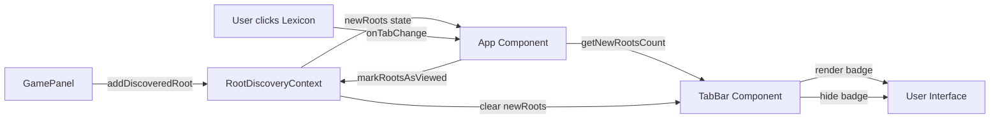

# Lexicon Tab Notification Badge Implementation Plan

## Overview
Implement a red circle notification badge on the Lexicon tab that shows a count of newly discovered Hebrew roots since the last time the Lexicon was opened. The badge updates in real-time as roots are discovered and automatically clears when the Lexicon tab is opened.

## Current State Analysis

### Existing Components
1. **`RootDiscoveryContext.jsx`** - Context for managing discovered roots with:
   - `newRoots` state array
   - `getNewRootsCount()` function
   - `markRootsAsViewed()` function to clear new roots
   - `addDiscoveredRoot()` function to add new roots

2. **`GamePanel.jsx`** - Main typing interface with:
   - Root detection using `checkRootCompletion()`
   - Own `discoveredRoots` state (not connected to context)
   - Root flag animation system

3. **`TabBar.jsx`** - Simple tab navigation component
4. **`App.jsx`** - Manages active tab state
5. **`LexiconPanel.jsx`** - Placeholder panel (currently not functional)

### Missing Integration
- `RootDiscoveryProvider` is not wrapped around the app
- `GamePanel` doesn't call `addDiscoveredRoot()` when roots are discovered
- `TabBar` doesn't display notification badges
- No auto-clear mechanism when Lexicon is opened

## Requirements

### Functional Requirements
1. **Real-time badge updates**: Badge count increments immediately when a root is discovered
2. **Visual design**: Red circle with white number, positioned top-right of Lexicon tab button
3. **Conditional display**: Only show badge when count > 0
4. **Auto-clear**: Badge clears when Lexicon tab is opened
5. **Count tracking**: Track roots discovered since last Lexicon view

### User Flow


## Technical Design

### 1. CSS Styling for Notification Badge
Add to `src/index.css`:
```css
/* Notification badge for tabs */
.tab-badge {
  position: absolute;
  top: 6px;
  right: 6px;
  background-color: var(--coral);
  color: white;
  border-radius: 50%;
  min-width: 18px;
  height: 18px;
  display: flex;
  align-items: center;
  justify-content: center;
  font-size: 11px;
  font-weight: 600;
  font-family: var(--font-body);
  line-height: 1;
  padding: 0 4px;
  box-shadow: 0 1px 3px rgba(0, 0, 0, 0.2);
  border: 1px solid rgba(255, 255, 255, 0.3);
  z-index: 1;
}

/* Hide badge when count is 0 */
.tab-badge:empty {
  display: none;
}
```

### 2. Component Modifications

#### **`src/main.jsx`** - Wrap app with RootDiscoveryProvider
```jsx
import { StrictMode } from 'react'
import { createRoot } from 'react-dom/client'
import './index.css'
import App from './App.jsx'
import { RootDiscoveryProvider } from './contexts/RootDiscoveryContext'

createRoot(document.getElementById('root')).render(
  <StrictMode>
    <RootDiscoveryProvider>
      <App />
    </RootDiscoveryProvider>
  </StrictMode>,
)
```

#### **`src/App.jsx`** - Integrate with RootDiscoveryContext
```jsx
import { useState, useEffect } from 'react'
import { useRootDiscovery } from './contexts/RootDiscoveryContext'
// ... other imports

export default function App() {
  const [activeTab, setActiveTab] = useState('main')
  const { markRootsAsViewed, getNewRootsCount } = useRootDiscovery()

  // Handle tab change with auto-clear for Lexicon
  const handleTabChange = (tabId) => {
    if (tabId === 'lexicon') {
      markRootsAsViewed() // Clear notification badge
    }
    setActiveTab(tabId)
  }

  // ... rest of component
  return (
    <div className="app-container">
      <TabBar 
        activeTab={activeTab} 
        onTabChange={handleTabChange}
        newRootsCount={getNewRootsCount()}
      />
      {/* ... */}
    </div>
  )
}
```

#### **`src/components/TabBar.jsx`** - Add notification badge
```jsx
import React from 'react'

const TabBar = ({ activeTab, onTabChange, newRootsCount = 0 }) => {
  const tabs = [
    { id: 'main', label: 'Main' },
    { id: 'lexicon', label: 'Lexicon' },
    { id: 'progress', label: 'Progress' },
  ]

  return (
    <div className="tab-bar">
      <div className="tab-list">
        {tabs.map((tab) => (
          <button
            key={tab.id}
            className={`tab-button ${activeTab === tab.id ? 'active' : ''}`}
            onClick={() => onTabChange(tab.id)}
            aria-selected={activeTab === tab.id}
            role="tab"
          >
            <span className="tab-label">{tab.label}</span>
            {tab.id === 'lexicon' && newRootsCount > 0 && (
              <div className="tab-badge">
                {newRootsCount > 9 ? '9+' : newRootsCount}
              </div>
            )}
            {activeTab === tab.id && <div className="tab-indicator" />}
          </button>
        ))}
      </div>
    </div>
  )
}

export default TabBar
```

#### **`src/components/main/GamePanel.jsx`** - Integrate with RootDiscoveryContext
In the TYPE reducer case where root is discovered:
```jsx
// Add import
import { useRootDiscovery } from '../../contexts/RootDiscoveryContext'

// In GamePanel component
const GamePanel = () => {
  const { addDiscoveredRoot } = useRootDiscovery()
  
  // In reducer or handler when root is discovered:
  if (rootDiscovery) {
    // Add to context
    addDiscoveredRoot({
      id: rootDiscovery.rootId,
      // ... other root data from roots.json
    })
    
    // ... existing state updates
  }
}
```

### 3. Data Flow Architecture


## Implementation Steps

### Phase 1: Foundation Setup
1. **Wrap app with RootDiscoveryProvider** in `main.jsx`
2. **Add CSS styles** for notification badge in `index.css`
3. **Update TabBar component** to accept and display badge count

### Phase 2: Context Integration
4. **Modify App component** to use RootDiscoveryContext
   - Get new roots count
   - Call `markRootsAsViewed()` when Lexicon tab is opened
5. **Update GamePanel component** to call `addDiscoveredRoot()`
   - Import `useRootDiscovery` hook
   - Call `addDiscoveredRoot()` when root is first discovered
   - Pass root data from `roots.json`

### Phase 3: Testing & Polish
6. **Test complete user flow**
   - Type word with root → badge appears
   - Click Lexicon tab → badge clears
   - Discover more roots → badge reappears
7. **Handle edge cases**
   - Multiple rapid root discoveries
   - Count > 9 (show "9+")
   - Dark mode compatibility
8. **Performance considerations**
   - Ensure real-time updates don't cause re-render issues
   - Optimize context updates

## Files to Modify

1. **`src/main.jsx`** - Add RootDiscoveryProvider wrapper
2. **`src/index.css`** - Add `.tab-badge` styles
3. **`src/components/TabBar.jsx`** - Add badge rendering logic
4. **`src/App.jsx`** - Integrate with context, handle tab change
5. **`src/components/main/GamePanel.jsx`** - Call `addDiscoveredRoot()`

## Success Criteria

1. ✅ Red circle badge appears on Lexicon tab when roots are discovered
2. ✅ White number shows count of new roots (1-9, or "9+" for 10+)
3. ✅ Badge updates in real-time as new roots are discovered
4. ✅ Badge automatically clears when Lexicon tab is opened
5. ✅ Badge only shows when count > 0
6. ✅ Works in both light and dark themes
7. ✅ No performance degradation during typing

## Edge Cases & Considerations

### Count Display
- Numbers 1-9: Show as-is
- Numbers 10+: Show as "9+" (or consider dynamic sizing)
- Very large counts unlikely (only 31 roots total)

### Multiple Root Discoveries
- Rapid typing could trigger multiple root discoveries
- Context should handle batch updates efficiently
- Badge should update smoothly

### Tab Switching
- User might switch to Lexicon while root flag animation is still showing
- Should still clear badge immediately
- Root flag animation continues independently

### Persistence
- Current implementation: session-only (clears on refresh)
- Future enhancement: Add localStorage persistence

### Accessibility
- Badge should have appropriate ARIA attributes
- Screen readers should announce "Lexicon tab, 3 new roots"
- Consider adding tooltip on hover

## Future Enhancements

1. **Persistence**: Save discovered roots across browser sessions
2. **Animation**: Add subtle pulse animation to draw attention
3. **Sound**: Optional sound when badge appears
4. **Customization**: Allow users to disable badge notifications
5. **Multiple badges**: Extend to other tabs if needed
6. **Root detail**: Click badge to jump to newly discovered roots in Lexicon

## Testing Plan

### Manual Test Cases
1. **Basic flow**: Type "בראשית" → badge shows "1" → click Lexicon → badge clears
2. **Multiple roots**: Discover 3 roots → badge shows "3" → clear → discover 2 more → badge shows "2"
3. **Count limit**: Discover 12 roots → badge shows "9+"
4. **Tab switching**: Discover root → switch to Progress → switch to Lexicon → badge clears
5. **Dark mode**: Verify badge colors in dark theme

### Integration Tests
- GamePanel → RootDiscoveryContext integration
- RootDiscoveryContext → TabBar data flow
- Auto-clear on tab change

## Dependencies & Risks

### Dependencies
- `RootDiscoveryContext` must be properly implemented
- `roots.json` data structure must be stable
- GamePanel root detection must be working

### Risks
- Performance impact from context updates during typing
- State synchronization between GamePanel and context
- CSS positioning issues with badge placement

## Timeline & Priority

**Priority**: High - Core user experience feature  
**Complexity**: Medium - Requires multiple component integrations  
**Estimated Effort**: 2-3 hours implementation + testing

## Approval
This plan outlines the complete implementation for the Lexicon tab notification badge feature. Please review and provide feedback before proceeding with implementation.