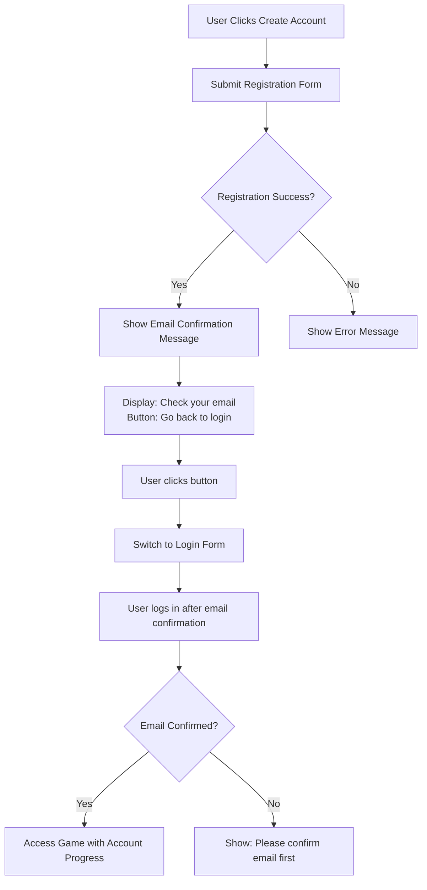

# Login Functionality Improvements Implementation Plan

## Overview
This plan addresses two main issues with the current authentication system:
1. **Registration flow improvement**: Add email confirmation message with "Go back to login" button
2. **Account-based progress tracking**: Ensure all progression is tracked by account only (not localStorage for authenticated users)

## Current Issues Identified

### 1. Registration Flow Issue
- **Problem**: When users register, the current `AuthScreen.jsx` calls `onAuthSuccess()` immediately (line 27), assuming registration is complete
- **Reality**: With Supabase email confirmation required, users need to confirm email before they can log in
- **Result**: Users see nothing happen after clicking "Create Account"

### 2. Progress Tracking Issue
- **Problem**: System saves to both localStorage AND Supabase for authenticated users
- **Requirement**: "All progression fully tracked by account only"
- **Result**: Potential data conflicts and localStorage fallback undermines account-only tracking

## Solution Design

### 1. Updated Registration Flow



### 2. AuthScreen Component Changes

**New State Variables Needed:**
```javascript
const [showConfirmation, setShowConfirmation] = useState(false)
const [registeredEmail, setRegisteredEmail] = useState('')
```

**Updated handleSubmit Logic:**
```javascript
if (isSignUp) {
  const { data, error } = await supabase.auth.signUp({ email, password })
  if (error) throw error
  
  if (data.user) {
    // Show confirmation message instead of calling onAuthSuccess()
    setShowConfirmation(true)
    setRegisteredEmail(email)
    // Clear form fields
    setEmail('')
    setPassword('')
  }
}
```

**New Confirmation Message UI:**
```jsx
{showConfirmation && (
  <div className="confirmation-message">
    <h3>Check Your Email</h3>
    <p>We've sent a confirmation email to <strong>{registeredEmail}</strong></p>
    <p>Please check your inbox and click the confirmation link to activate your account.</p>
    <button 
      type="button"
      className="auth-button"
      onClick={() => {
        setShowConfirmation(false)
        setIsSignUp(false)
      }}
    >
      Go back to login
    </button>
  </div>
)}
```

### 3. Login Flow Enhancement

**Check email confirmation status:**
```javascript
// In login logic
const { data, error } = await supabase.auth.signInWithPassword({ email, password })
if (error) {
  if (error.message.includes('Email not confirmed')) {
    setError('Please confirm your email before logging in. Check your inbox.')
  } else {
    setError(error.message)
  }
  throw error
}
```

### 4. Account-Only Progress Tracking

**Modify GamePanel.jsx:**

1. **Disable localStorage saving when userId exists:**
```javascript
// In the localStorage saving useEffect (around line 409)
useEffect(() => {
  if (!isLoaded || userId) return // Skip if user is authenticated
  
  // Only save to localStorage for unauthenticated users
  const progressToSave = { ... }
  saveProgress(progressToSave)
}, [isLoaded, userId, state.typedCounts, ...])
```

2. **Clear localStorage on successful authentication:**
```javascript
// In App.jsx or after successful login
if (session?.user) {
  // Optionally clear localStorage progress to ensure account-only tracking
  localStorage.removeItem('hebrew-bible-game-progress')
}
```

3. **Prioritize Supabase data loading:**
```javascript
// In GamePanel.jsx load progress logic
useEffect(() => {
  if (userId) {
    // Load from Supabase first
    loadFromSupabase()
  } else {
    // Load from localStorage for unauthenticated users
    const saved = loadProgressFromStorage()
    // ... existing logic
  }
}, [userId])
```

## Implementation Steps

### Step 1: Update AuthScreen.jsx
1. Add `showConfirmation` and `registeredEmail` state variables
2. Modify signup logic to show confirmation message instead of calling `onAuthSuccess()`
3. Add confirmation message UI with "Go back to login" button
4. Enhance login error handling for unconfirmed emails
5. Add CSS styles for confirmation message

### Step 2: Modify Progress Tracking
1. Update `useProgressPersistence` hook or its usage to skip localStorage when `userId` exists
2. Modify GamePanel's localStorage saving useEffect to check for `userId`
3. Ensure Supabase loading takes precedence over localStorage for authenticated users
4. Optionally clear localStorage progress on login

### Step 3: Update App.jsx Authentication Logic
1. Consider adding logic to clear localStorage when user authenticates
2. Ensure session state properly reflects email confirmation status

### Step 4: CSS Updates
Add styles for confirmation message in `src/index.css`:
```css
.confirmation-message {
  text-align: center;
  padding: 2rem;
  background: var(--color-surface);
  border-radius: 12px;
  margin-top: 1.5rem;
}

.confirmation-message h3 {
  color: var(--color-primary);
  margin-bottom: 1rem;
}

.confirmation-message p {
  margin-bottom: 1rem;
  line-height: 1.5;
}
```

## Files to Modify

1. **`src/components/ui/AuthScreen.jsx`** - Major changes for registration flow
2. **`src/components/main/GamePanel.jsx`** - Progress saving logic updates
3. **`src/index.css`** - New CSS styles for confirmation message
4. **`src/utils/useProgressPersistence.js`** (if exists) - Hook modification

## Testing Checklist

### Registration Flow
- [ ] User can register with email/password
- [ ] After registration, shows confirmation message (not game)
- [ ] Confirmation message includes registered email
- [ ] "Go back to login" button switches to login form
- [ ] Form fields are cleared after registration

### Login Flow  
- [ ] User cannot login without confirming email (shows appropriate error)
- [ ] After email confirmation, user can login successfully
- [ ] Login redirects to game with proper session

### Progress Tracking
- [ ] Unauthenticated users: progress saves to localStorage only
- [ ] Authenticated users: progress saves to Supabase only (not localStorage)
- [ ] Progress loads from Supabase for authenticated users
- [ ] No data loss when switching between authenticated/unauthenticated states

## Backward Compatibility Considerations

1. **Existing Users**: Users with localStorage progress who create accounts should have their progress migrated to Supabase
2. **Fallback Strategy**: If Supabase save fails for authenticated users, consider:
   - Retry mechanism
   - Temporary localStorage cache with sync on reconnect
   - User notification about sync failure

## Success Metrics
- Users receive clear feedback after registration (email confirmation message)
- No more "nothing happens" after clicking Create Account
- All game progress for authenticated users stored in Supabase only
- No localStorage progress conflicts for authenticated users