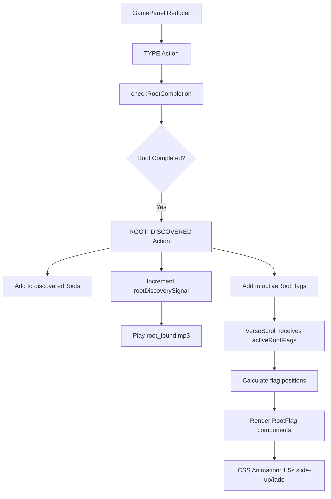

# Root Flag Animation Implementation Plan

## Overview
Implement root detection during typing with visual flag animation and audio feedback. When user types the last letter of a Hebrew root within a word, show a "Root Found" flag that animates like Super Mario Bros 1Up (quick slide up, slight bounce, fade out) with 1.5 second total lifetime.

## Current State Analysis

### Existing Components
1. **`rootDetection.js`** - Complete utility with `checkRootCompletion()` function
2. **`RootFlag.jsx`** - Basic component exists but needs animation updates
3. **`root_found.mp3`** - Audio file exists in `src/assets/audio/`
4. **`RootDiscoveryContext.jsx`** - Context for managing discovered roots
5. **`GamePanel.jsx`** - Main typing interface with reducer
6. **`VerseScroll.jsx`** - Displays Hebrew words with letter-by-letter typing

### Missing Pieces
1. CSS animations for Super Mario 1Up style flag
2. Integration of root detection in GamePanel reducer
3. Audio playback integration
4. Flag positioning relative to root letters
5. State management for active flags

## Technical Requirements

### 1. Root Flag Design
- **Size**: Smaller than the active verse word
- **Colors**: Coral red background (`--coral: #FF5F40`), white text
- **Text**: "Root Found" (no root letters included)
- **Animation**: 
  - Quick slide up from root letters
  - Slight bounce at top
  - Fade out
  - Total lifetime: 1.5 seconds
- **Positioning**: Directly above the root letters within the word

### 2. Audio Feedback
- Play `root_found.mp3` when root is first discovered
- Only play once per root (first discovery)
- Audio should play simultaneously with flag animation

### 3. Root Detection Logic
- Use existing `checkRootCompletion()` from `rootDetection.js`
- Detect when last letter of root is typed
- Only trigger for first discovery of each root
- Example: In "בראשית" (bereshit), detect when last letter of root "ראש" is typed

## Implementation Steps

### Step 1: Update GamePanel Reducer State
Add to `initialState` in `GamePanel.jsx`:
```javascript
const initialState = {
  // ... existing state
  discoveredRoots: {},           // { [rootId]: true } - tracks all discovered roots
  activeRootFlags: [],           // Array of active flag objects for display
  rootDiscoverySignal: 0,        // Increments when root is discovered → triggers audio
};
```

Add new action types:
```javascript
'ROOT_DISCOVERED'   // When a root is first detected
'FLAG_COMPLETED'    // When a flag animation completes
```

### Step 2: Modify TYPE Action in Reducer
In the TYPE case of the reducer, after successful keypress:
1. Get current word ID and typed count
2. Call `checkRootCompletion(wordId, newTyped, state.discoveredRoots)`
3. If returns root discovery info:
   - Dispatch `ROOT_DISCOVERED` action
   - Add root to `discoveredRoots`
   - Add flag data to `activeRootFlags`
   - Increment `rootDiscoverySignal`

### Step 3: Create CSS Animations
Add to `src/index.css`:
```css
/* Super Mario 1Up Animation */
@keyframes rootFlagSlideUp {
  0% {
    transform: translateY(0) scale(0.8);
    opacity: 0;
  }
  20% {
    transform: translateY(-30px) scale(1);
    opacity: 1;
  }
  40% {
    transform: translateY(-50px) scale(1.05);
    opacity: 1;
  }
  60% {
    transform: translateY(-45px) scale(1);
    opacity: 1;
  }
  80% {
    transform: translateY(-60px) scale(0.95);
    opacity: 0.8;
  }
  100% {
    transform: translateY(-80px) scale(0.9);
    opacity: 0;
  }
}

/* Root Flag Styles */
.root-flag {
  position: absolute;
  z-index: 1000;
  pointer-events: none;
  animation: rootFlagSlideUp 1.5s cubic-bezier(0.25, 0.46, 0.45, 0.94) forwards;
}

.root-flag-content {
  background-color: var(--coral);
  color: white;
  padding: 4px 10px;
  border-radius: 12px;
  font-size: 12px;
  font-weight: 600;
  font-family: var(--font-body);
  white-space: nowrap;
  box-shadow: 0 2px 8px rgba(0, 0, 0, 0.2);
  border: 1px solid rgba(255, 255, 255, 0.3);
}
```

### Step 4: Update RootFlag Component
Modify `RootFlag.jsx`:
1. Remove existing timer logic (replaced by CSS animation)
2. Use CSS animation for 1.5s lifetime
3. Call `onHide` callback when animation ends
4. Simplify to just display "Root Found" text

### Step 5: Add Audio Integration to GamePanel
In `GamePanel.jsx`:
1. Create audio ref for `root_found.mp3`
2. Add useEffect that triggers audio when `rootDiscoverySignal` changes
3. Play audio with error handling

### Step 6: Implement Flag Positioning
Challenge: Need to position flag above specific root letters within a word in VerseScroll.

Solution options:
1. **Option A**: Pass positioning data from VerseScroll to GamePanel
   - VerseScroll would need to expose refs to letter elements
   - Calculate position based on root segment indices
   - Pass coordinates to RootFlag

2. **Option B**: Render RootFlag within VerseScroll
   - Add RootFlag as child of VerseScroll
   - VerseScroll manages flag positioning internally
   - Cleaner separation of concerns

Recommended: **Option B** - Render flags within VerseScroll component.

### Step 7: Update VerseScroll Component
1. Accept `activeRootFlags` prop from GamePanel
2. For each flag, calculate position based on:
   - Verse index
   - Word index  
   - Root start/end indices from `rootDetection.js`
3. Render RootFlag components at calculated positions
4. Use `getBoundingClientRect()` or CSS transforms for positioning

### Step 8: Integration Testing
Test with "בראשית" (bereshit):
1. Type ב, ר, א, ש (root "ראש" complete)
2. Verify:
   - `root_found.mp3` plays
   - Coral red "Root Found" flag appears above ש letter
   - Flag animates up and fades in 1.5s
   - Flag doesn't appear again for same root

## Component Architecture



## Files to Modify

1. **`src/components/main/GamePanel.jsx`**
   - Add state to reducer
   - Add audio ref and playback
   - Dispatch ROOT_DISCOVERED action

2. **`src/components/main/sub-components/RootFlag.jsx`**
   - Simplify component
   - Use CSS animation
   - Remove timer logic

3. **`src/components/main/sub-components/VerseScroll.jsx`**
   - Accept `activeRootFlags` prop
   - Calculate flag positions
   - Render RootFlag components

4. **`src/index.css`**
   - Add root flag CSS styles
   - Add Super Mario 1Up animation keyframes

5. **`src/contexts/RootDiscoveryContext.jsx`** (optional)
   - Update to sync with GamePanel state

## Success Criteria

1. ✅ Root detection works for "בראשית" → flag appears when ש is typed
2. ✅ Coral red flag with white "Root Found" text
3. ✅ Super Mario 1Up animation (slide up, bounce, fade in 1.5s)
4. ✅ `root_found.mp3` plays on first discovery
5. ✅ Flag positioned above root letters
6. ✅ Flag only shows once per root
7. ✅ No performance issues during typing

## Next Steps After Implementation

1. Add Lexicon panel integration (red dot badge)
2. Persist discovered roots across sessions
3. Add root detail view in Lexicon
4. Implement concordance map for discovered words