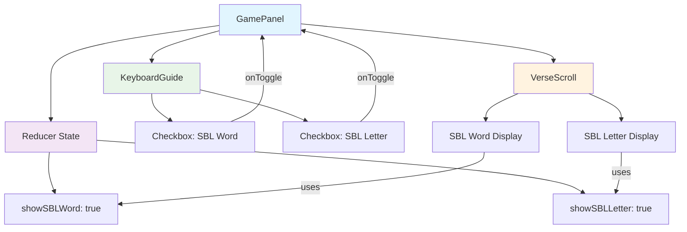

# SBL Checkboxes - Architecture Diagram



## Data Flow
1. User toggles checkbox in KeyboardGuide
2. KeyboardGuide calls `onToggleSBLWord` or `onToggleSBLLetter`
3. GamePanel dispatches reducer action (`TOGGLE_SBL_WORD` or `TOGGLE_SBL_LETTER`)
4. Reducer updates state (`showSBLWord` or `showSBLLetter`)
5. Updated state flows down to both KeyboardGuide (for checkbox checked state) and VerseScroll (for SBL display)
6. VerseScroll conditionally renders SBL based on state values

## Component Interfaces

### GamePanel → KeyboardGuide Props
```javascript
showSBLWord: boolean
showSBLLetter: boolean
onToggleSBLWord: () => void
onToggleSBLLetter: () => void
```

### GamePanel → VerseScroll Props
```javascript
showSBLWord: boolean
showSBLLetter: boolean
```

## CSS Layout Structure
```
.keyboard-guide (flex container)
├── .kb-rows (keyboard layout)
└── .sbl-controls (right side panel)
    ├── .sbl-checkbox (SBL Letter)
    └── .sbl-checkbox (SBL Word)
```

## Testing Checklist
- [ ] Checkboxes appear on right side of keyboard guide
- [ ] Both checkboxes checked by default
- [ ] Toggling SBL Word checkbox hides/shows word-level SBL
- [ ] Toggling SBL Letter checkbox hides/shows letter-level SBL
- [ ] Checkboxes work independently
- [ ] SBL display updates immediately on toggle
- [ ] Works with partially typed words
- [ ] Works with completed words
- [ ] Layout responsive on different screen sizes