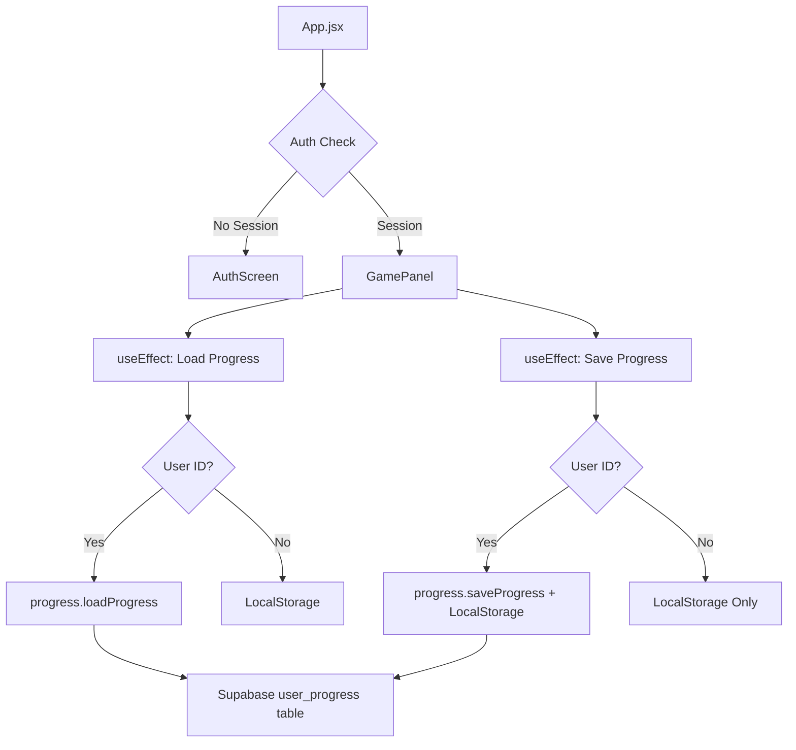

# Supabase Authentication & Progress Saving Implementation Plan

## Overview
Integrate Supabase authentication and cloud progress saving into the existing Hebrew Bible learning game. This will allow users to create accounts, log in, and have their progress saved to Supabase database instead of just localStorage.

## Current State Analysis

### Existing Progress Tracking
The game currently tracks progress in two places:

1. **GamePanel Reducer State** (`src/components/main/GamePanel.jsx`):
   - `typedCounts`: Object mapping `"verseIndex-wordIndex"` to typed character counts
   - `wordEncounters`: Object mapping word IDs to completion counts
   - `currentVerse`: Current verse index (0-based)
   - `highestVerse`: Highest verse reached
   - `carouselIdxMap`: Carousel position per verse
   - `celebratedVerses`: Array of verses that have played completion sound
   - `discoveredRoots`: Object mapping root IDs to boolean (in reducer)

2. **RootDiscoveryContext** (`src/contexts/RootDiscoveryContext.jsx`):
   - `discoveredRoots`: Array of root objects with id, sbl, gloss, etc.
   - `discoveredWordsByRoot`: Object mapping root IDs to arrays of word IDs

### Existing Persistence
- LocalStorage keys:
  - `hebrew-bible-game-progress`: Game progress data
  - `hebrew-bible-game-lexicon`: Discovered roots and words

## Supabase Table Structure
Table: `user_progress`
- `id` (uuid, primary key)
- `user_id` (uuid, references auth.users)
- `discovered_roots` (jsonb)
- `completed_verses` (jsonb) 
- `word_encounters` (jsonb)
- `current_verse_index` (integer)
- `created_at` (timestamp)
- `updated_at` (timestamp)

## Implementation Steps

### Step 1: Create AuthScreen Component (`src/components/ui/AuthScreen.jsx`)
A simple login/signup screen with:
- Email and password inputs
- Toggle between signup and signin modes
- Submit button that calls `supabase.auth.signUp` or `supabase.auth.signInWithPassword`
- Error message display
- `onAuthSuccess` callback prop

### Step 2: Update App.jsx for Authentication Wrapper
- Wrap entire app in authentication logic
- On mount: check existing session with `supabase.auth.getSession()`
- Listen for auth state changes with `supabase.auth.onAuthStateChange()`
- Render loading state during initial check
- If no session: render `AuthScreen`
- If session exists: render main game tabs, pass `session.user.id` as `userId` prop to `GamePanel`

### Step 3: Create Progress Library (`src/lib/progress.js`)
Two exported async functions:
1. `loadProgress(userId)`: 
   - Queries `user_progress` table filtering by `user_id`
   - Returns data or `null` if not found
   - Maps Supabase fields to game state format

2. `saveProgress(userId, progress)`:
   - Upserts row to `user_progress` table
   - Includes `user_id`, all progress fields, and `updated_at` timestamp
   - Returns success/failure

### Step 4: Modify GamePanel for Supabase Integration
Add two `useEffect` hooks:

1. **Load Progress Effect** (runs when `userId` is available):
   - Calls `loadProgress(userId)`
   - If data returned, sets `discoveredRoots`, `completedVerses`, `wordEncounters`, `currentVerseIndex`
   - Falls back to localStorage if no Supabase data

2. **Save Progress Effect** (watches progress state changes):
   - Watches `discoveredRoots`, `completedVerses`, `wordEncounters`, `currentVerseIndex`
   - When any change, calls `saveProgress(userId, currentValues)`
   - Guards: doesn't run if `userId` is not available
   - Also saves to localStorage as fallback

### Step 5: Data Mapping Strategy
Map game state to Supabase table:

| Game State | Supabase Field | Format |
|------------|----------------|--------|
| `discoveredRoots` (from RootDiscoveryContext) | `discovered_roots` | JSON array of root objects |
| `typedCounts` → derived completed verses | `completed_verses` | JSON array of verse indices where all words completed |
| `wordEncounters` | `word_encounters` | JSON object mapping word IDs to counts |
| `currentVerse` | `current_verse_index` | Integer (0-based) |

### Step 6: Backward Compatibility
- Maintain localStorage as fallback for unauthenticated users
- When user authenticates: load from Supabase, merge with localStorage if needed
- Save to both Supabase (if authenticated) and localStorage (always)

## File Changes

### New Files
1. `src/components/ui/AuthScreen.jsx` - Authentication UI component
2. `src/lib/progress.js` - Supabase progress operations

### Modified Files
1. `src/App.jsx` - Add authentication wrapper logic
2. `src/components/main/GamePanel.jsx` - Add Supabase load/save effects
3. `src/lib/supabase.js` - Already exists (confirmed)

### No Changes Needed
1. `src/contexts/RootDiscoveryContext.jsx` - Keep existing localStorage persistence
2. `src/utils/useProgressPersistence.js` - Keep for localStorage fallback
3. Game logic, typing mechanics, verse display, keyboard, or sound code

## Component Architecture

## Error Handling
- Network failures: Fall back to localStorage
- Supabase errors: Log to console, continue with localStorage
- Data corruption: Use default state, log warning

## Testing Considerations
1. Create account and log in
2. Verify progress saves to Supabase
3. Log out and back in - progress should persist
4. Test on different devices with same account
5. Verify localStorage fallback works when offline

## Success Criteria
- Users can create accounts and log in
- Game progress saves to Supabase when authenticated
- Progress loads from Supabase on login
- LocalStorage works as fallback for unauthenticated users
- No breaking changes to existing game functionality