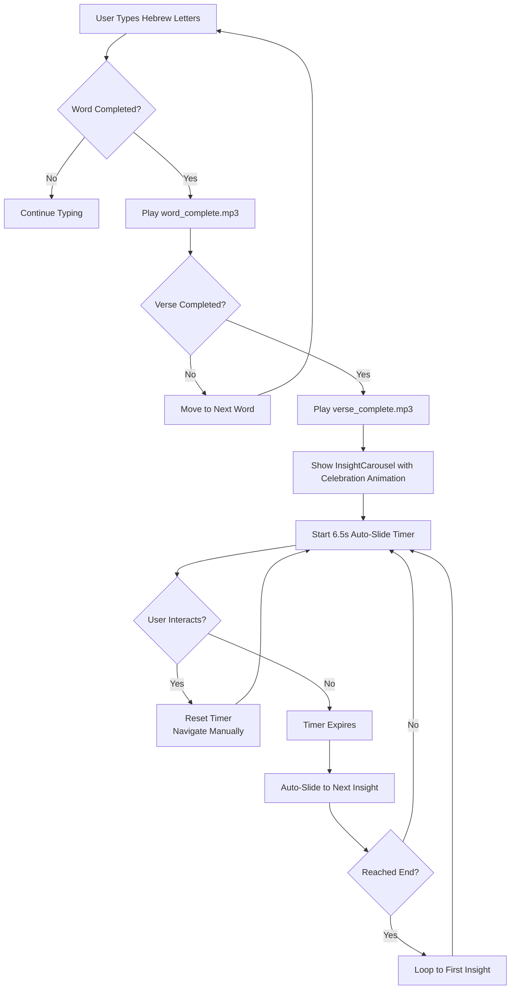
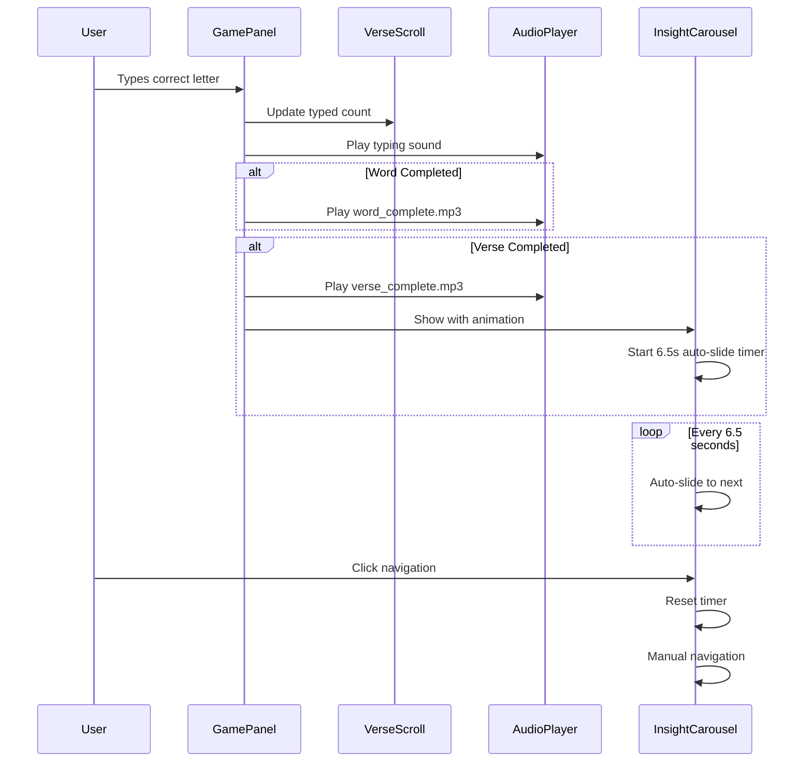
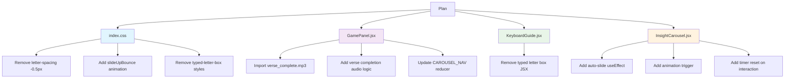

# Verse Completion Workflow Diagram

## System Flow



## Component Interactions



## File Modification Map



## Animation Timeline

```mermaid
gantt
    title InsightCarousel Celebration Animation
    dateFormat  SS
    axisFormat %S
    
    section Animation Phases
    Verse Completion :0, 1s
    Audio Playback :0, 2s
    Slide Up :1, 2s
    Bounce :2, 3s
    Settle :3, 4s
    
    section Auto-Slide Cycle
    Timer Start :4, 5s
    Display Insight 1 :4, 10s
    Auto-Slide to Insight 2 :10, 11s
    Display Insight 2 :11, 16s
    Auto-Slide to Insight 3 :16, 17s
    Loop Back to Insight 1 :17, 18s
```

## Key Implementation Points

1. **Kerning Removal**: Simple CSS change in `src/index.css` line 202
2. **Typed Letter Box Removal**: Remove JSX in `KeyboardGuide.jsx` and CSS in `index.css`
3. **Verse Completion Audio**: Add new audio ref and trigger in `GamePanel.jsx`
4. **Celebration Animation**: CSS keyframes + React state trigger
5. **Auto-Slide Timer**: `setInterval` with 6500ms in `InsightCarousel.jsx`
6. **Loop Logic**: Already implemented via modulo operation in reducer
7. **Timer Reset**: Clear and restart interval on user interaction